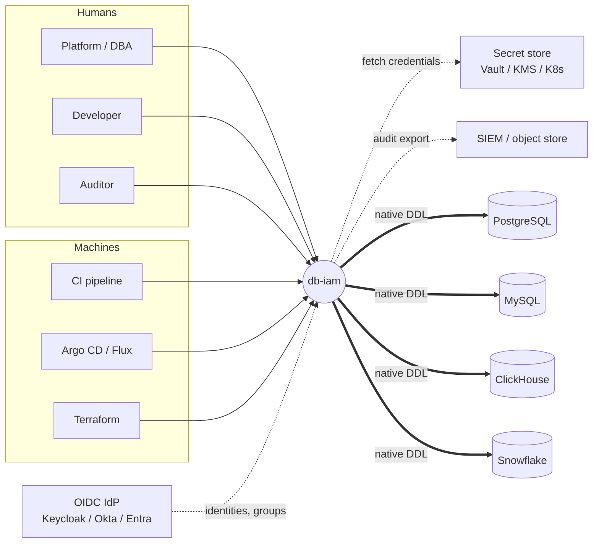
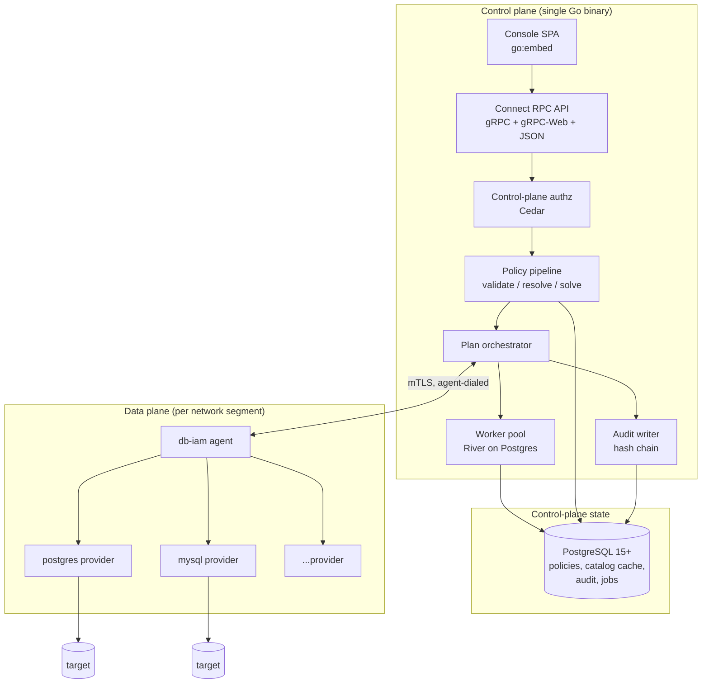
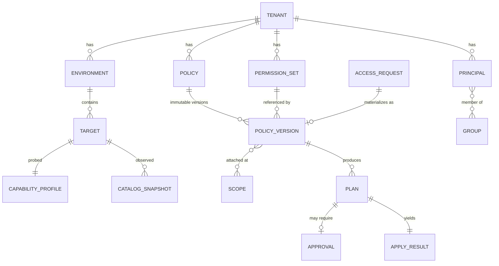
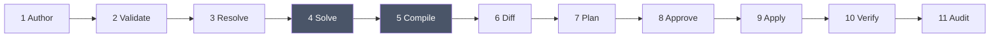
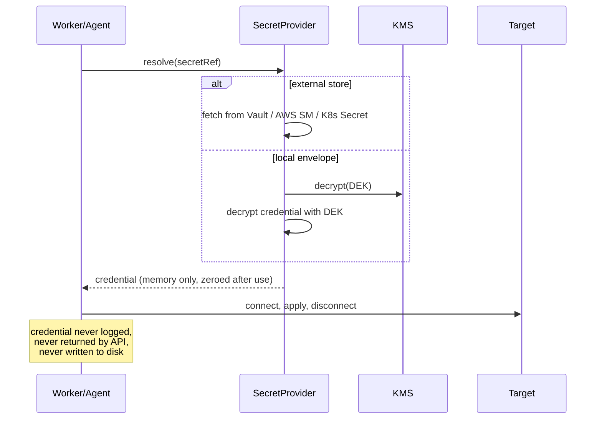

# db-iam — Architecture & High-Level Design

> Version 0.1 · 2026-09-13 · Status: **draft for review**
> Companion to [RESEARCH.md](./RESEARCH.md). This document defines the system's structure, its core abstractions, and the safety properties it must hold. It does not specify APIs field-by-field — that follows in the protobuf definitions.

---

## 1. Purpose and scope

db-iam manages **who may do what, on which database objects**, across heterogeneous database engines, by compiling a single declarative policy into each engine's own native privilege primitives.

### In scope
- Declarative policy authoring (IAM-shaped JSON, lowered to Cedar)
- Deterministic compilation to native `GRANT`/`REVOKE`/row-policy/role statements
- Plan → approve → apply workflow with drift detection and reconciliation
- Identity federation (OIDC), JIT access requests, credential lifecycle
- Tamper-evident audit and point-in-time access review evidence
- A console, a CLI, a Kubernetes operator and a Terraform provider over one API

### Explicitly out of scope (v1)
- **Any component in the query data path.** No wire proxy, no connection pooler. Enforcement is native.
- Identity provider functionality. db-iam consumes OIDC; it does not issue identities.
- SQL editing, schema migration, query analysis. Adjacent products own these.
- Data discovery / classification. Consume tags from elsewhere; don't compute them.

### The single defining constraint

> **db-iam must never be the reason an access control is weaker than the policy says it is.**

Every design decision below resolves in favour of this. Where a policy cannot be faithfully compiled, the system refuses rather than approximates.

---

## 2. Decisions carried forward

These resolve the open questions in [RESEARCH.md §10](./RESEARCH.md). Each is a decision, not a preference — flag any you disagree with before implementation begins.

| # | Decision | Rationale | Reversibility |
|---|---|---|---|
| **D1** | **Native-privilege compilation**, no data-path component | No new failure domain; enforcement survives any client. | Hard — shapes everything |
| **D2** | **IAM-shaped JSON as the user-facing format, Cedar as the canonical IR** | Familiar surface, formally verifiable core. | Medium — IR is internal |
| **D3** | **`adopt` reconcile mode by default**; `additive` and `authoritative` opt-in | Authoritative-by-default is unadoptable on an existing cluster. | Easy — a per-target setting |
| **D4** | **Identity materialization is a pluggable strategy**, defaulting to `per-principal-role` for humans and `shared-role` for service accounts | See §8 — this choice determines whether `Deny` is even expressible. | Medium — per-target setting, but migrations are disruptive |
| **D5** | **MySQL is the second engine** | It lacks RLS, forcing capability-negotiation machinery early while the cost of getting it wrong is low. | Easy |
| **D6** | **Apache-2.0** | Matches Cedar/CNCF; lowest friction for a privileged tool. | Effectively irreversible |
| **D7** | **Go**, single binary with embedded console | Driver coverage across all target engines; operator and Terraform ecosystems. | Hard |
| **D8** | **Agent is optional, not mandatory** | Direct connection for simple deployments; agent for network-isolated ones. Same provider code runs in both. | Easy |

---

## 3. System context



**Trust boundaries.** Three, and they matter:

1. **Console/CLI → control plane.** Untrusted clients. Every request re-derives identity, tenant membership and permission server-side. Nothing from the client is load-bearing for authorization — not a tenant id, not an `Origin` header, not a subdomain.
2. **Control plane → agent.** Mutually authenticated (mTLS). The agent holds target credentials; the control plane holds policy. Neither alone is sufficient to change a database.
3. **Agent → database.** The only place a privileged database credential is dereferenced. Credentials are fetched from the secret store at use time, never persisted by db-iam.

---

## 4. Container view



### Processes

| Process | Responsibility | Stateless? | Scaling |
|---|---|---|---|
| **Control plane** | API, policy pipeline, orchestration, console | Yes (state in Postgres) | Horizontal; leader election only for scheduled reconcile |
| **Worker** | Reconcile loops, drift scans, credential expiry, audit export | Yes | Horizontal; work claimed via `SKIP LOCKED` |
| **Agent** | Provider execution against targets in a private segment | Yes (credentials fetched per use) | One or more per segment; targets sharded by consistent hash |

Workers run in-process in the control plane binary by default (`--mode=all`), and can be split out (`--mode=api` / `--mode=worker`) for larger installs. **One binary, three roles** — this keeps the single-command install honest without capping scale.

---

## 5. Core domain model



### Key entities

**`Principal`** — a human (mirrored from OIDC), a service account, or a group. Humans and groups are *projections* of the IdP: db-iam never becomes the source of truth for identity. A principal has a stable internal id, an external subject claim, and attributes (department, team, clearance) usable in policy conditions.

**`Target`** — one database instance. Carries `engine`, connection descriptor, `secretRef`, environment, reconcile mode, and identity strategy. Never carries a credential value.

**`CapabilityProfile`** — the *probed* result of connecting to a target: version, edition, hierarchy segments, row-filter support, masking support, transactional DDL, future-grant support, managed-provider restrictions. Refreshed on connect and cached with a TTL. **Never inferred from the engine name** — the same engine differs by version, edition and managed provider.

**`ResourcePath`** — an ordered list of typed segments, each `kind:name` with glob support:

```
dbi:<engine>:target/<t>:db/<d>[:schema/<s>]:table/<tbl>[:column/<c>]
```

The engine segment may be `*`, meaning "every target whose capability profile can express this". Segment *kinds* are canonical; which kinds a given provider consumes is declared in its capability profile. MySQL folds `db` and `schema`; MongoDB uses `collection`/`field`. **A path is portable; its projection is per-provider.**

**`PermissionSet`** — a named, reusable bundle of actions (`reader`, `writer`, `ddl`, `pii-reader`). This is pgbedrock's central insight — raw engine privileges are too subtle for most users, so the default vocabulary should be coarse and safe, with raw privileges available as an escape hatch. Permission sets are the primary UX; raw actions are the power tool.

**`Policy` / `PolicyVersion`** — versions are **immutable and content-addressed** (hash of canonical JSON). A plan references a policy version hash, so an approved plan cannot be silently swapped for different content. Policies attach at a `Scope` (tenant, environment, or target), which bounds where they are evaluated.

**`CatalogSnapshot`** — observed state of a target: principals, objects, privileges, row policies, memberships. Versioned and hashed. It is an **input to the solver**, not merely to the diff, because resource globs expand against real objects.

---

## 6. The policy pipeline

This is the system's core. It is a pure function everywhere it can be, with side effects confined to the last two stages.



| Stage | Runs in | Input → Output | Pure? |
|---|---|---|---|
| 1 Author | client | — → `PolicyDocument` | — |
| 2 Validate | control plane | doc → Cedar AST + schema check | ✅ |
| 3 Resolve | control plane | AST + IdP + `CatalogSnapshot` → resolved tuples | ✅ given inputs |
| 4 **Solve** | control plane | tuples → `EffectivePermissionSet` | ✅ |
| 5 **Compile** | provider | `EffectivePermissionSet` + `CapabilityProfile` → `StatementSet` | ✅ |
| 6 Diff | provider | `StatementSet` + `CatalogSnapshot` → delta | ✅ |
| 7 Plan | control plane | delta → ordered, classified, hashed `Plan` | ✅ |
| 8 Approve | control plane | `Plan` → approval record | side effect |
| 9 Apply | agent → target | `Plan` → `ApplyResult` | **side effect** |
| 10 Verify | agent | re-introspect → convergence assertion | ✅ |
| 11 Audit | control plane | everything → hash-chained record | side effect |

### The critical boundary: `EffectivePermissionSet`

Stages 1–4 are **entirely engine-neutral**. Stages 5–10 are **entirely provider-specific**. `EffectivePermissionSet` is the intermediate representation between them, and it is the most important type in the system:

```go
// Engine-neutral. Deny already subtracted. Group membership already expanded.
// Static conditions already evaluated. Everything remaining is either
// directly expressible or must be refused.
type EffectivePermissionSet struct {
    Target  TargetRef
    Grants  []Grant
    // Conditions that could not be evaluated at compile time and must be
    // lowered into engine-native runtime constructs — or refused.
    Deferred []DeferredCondition
}

type Grant struct {
    Principal PrincipalRef
    Action    Action        // canonical verb: Select, Insert, Update, Delete, Create, ...
    Resource  ResourcePath  // fully concrete — no globs remain
    Columns   *ColumnSet    // nil = all columns; non-nil = explicit allow-list
    RowFilter *Predicate    // engine-neutral AST, rendered per provider
    Mask      *MaskSpec     // nil = no masking
}
```

Two invariants make this work:

- **No globs survive stage 4.** Every `Grant` names a concrete object that existed in the snapshot. Glob expansion is the solver's job because deny-subtraction is only meaningful over concrete objects.
- **No deny survives stage 4.** Providers receive only positive grants. A provider never reasons about deny semantics, which is what makes adding an engine tractable.

### Static vs. deferred conditions

A condition is **static** if it can be evaluated when the plan is built — principal attributes, resource tags, environment, a time window with fixed bounds. Static conditions are resolved by the solver and disappear.

A condition is **deferred** if it depends on the query session — the connected user, a session variable, request time at query time. Deferred conditions *must* be lowered into an engine-native runtime construct (a row policy predicate, a session setting), and if the provider cannot express one, the plan is **refused**.

This distinction is easy to miss and expensive to retrofit. It is the reason `Predicate` is an engine-neutral AST rather than a SQL string: the same `tenant_id = ${session.tenant}` renders as `current_setting('dbiam.tenant')` on Postgres, a session-context function on Snowflake, and **nothing at all** on MySQL — where it produces `ErrUnsupported`.

---

## 7. The solver

Stage 4 in detail, because it is where correctness is won or lost.

### Algorithm

```
INPUT:  statements S, principals P (with group closure), catalog snapshot C
OUTPUT: EffectivePermissionSet, or ConflictReport

1. EXPAND
   for each statement s in S:
     principals ← resolve(s.principals, P)      # groups → transitive members
     resources  ← expand(s.resources, C)        # globs → concrete objects
     for each (p, a, r) in principals × s.actions × resources:
        emit tuple(p, a, r, s.effect, s.conditions, s.sid)

2. PARTITION CONDITIONS
   for each tuple: split conditions into static | deferred
   evaluate static; drop tuple if a static condition is false

3. SUBTRACT DENY                       # deny wins, unconditionally
   allow ← { t ∈ tuples : t.effect = Allow }
   deny  ← { t ∈ tuples : t.effect = Deny  }
   grants ← { a ∈ allow : ¬∃ d ∈ deny . matches(d, a) }

   # Column-level deny narrows rather than removes:
   for each a ∈ allow where deny targets a *column* of a.resource:
       a.Columns ← columns(a.resource, C) \ denied_columns

4. VERIFY SATISFIABILITY               # see below — the hard part
   for each d ∈ deny:
      if reachable(d.principal, d.action, d.resource, grants, identityStrategy):
         report Conflict{ sid: d.sid, reason: ... }

5. MERGE + NORMALISE
   coalesce grants per (principal, resource); union columns; AND row filters
```

### Step 4 is the subtle one

Consider: Alice is a member of group `analysts`. A policy grants `analysts` SELECT on `public.*`. Another policy denies Alice SELECT on `public.salaries`.

No SQL engine has a persistent deny. The grant set must therefore be constructed so Alice simply never receives that privilege — but if Alice is a *member of a shared database role* that holds it, she has it. The deny is **unsatisfiable under that identity strategy**.

There are exactly two honest resolutions, and the choice is `Target.identityStrategy` (§8):

- **`shared-role`** — Alice is a member of a DB role shared with other analysts. The deny cannot be expressed. The solver emits a **`ConflictReport`** naming the policy, the principal, the resource and the specific membership that defeats it. The plan does not proceed. The author must narrow the group grant or switch strategy.
- **`per-principal-role`** — Alice has her own DB role carrying her exact computed grant set, with no membership in shared privilege-bearing roles. The deny is always satisfiable because her grant set is computed, not inherited.

**This is why D4 exists and why it is not a minor configuration detail.** `per-principal-role` is the default for humans precisely because a security tool that silently drops denies is worse than no tool.

### Complexity and bounds

Naive expansion is `|principals| × |actions| × |objects|`. On a large Postgres cluster (10⁵ tables, 10³ principals) that is intractable if done literally.

Mitigations, in order of application:
1. **Keep globs symbolic through expansion**; materialise only where a deny or a column/row qualifier forces concreteness. Most grants are `schema.*` and stay symbolic all the way to `GRANT ... ON ALL TABLES IN SCHEMA`.
2. **Index the deny set** by resource prefix, so `matches()` is a trie lookup rather than a scan.
3. **Incremental solve** — cache per-(policy-version, snapshot-version) results; recompute only the subtree a change touches.
4. **Hard budget** — refuse to build a plan exceeding a configured tuple count, rather than hanging. Surfacing "this policy expands to 40M grants, narrow it" is a better product than a timeout.

---

## 8. Identity materialization

How a db-iam `Principal` becomes a native database object. Pluggable per target; determines Deny expressibility, audit granularity and blast radius.

| Strategy | Native objects created | `Deny` expressible | In-DB audit granularity | Standing privilege | Best fit |
|---|---|---|---|---|---|
| `shared-role` | One DB role per `PermissionSet`; principals are members | ❌ conflicts reported | Coarse — DB sees the shared role | Yes | Service accounts, BI tools, very large orgs |
| `per-principal-role` *(default, humans)* | One DB role per principal, grants computed directly | ✅ always | Per-human in native DB logs | Yes | Regulated environments, most orgs |
| `ephemeral` | Role minted per session with a TTL, auto-dropped | ✅ | Per-session | **None** | JIT access, break-glass, contractors |

`ephemeral` is the endgame — zero standing privilege, which is what Teleport and Vault sell — but it requires the access-request workflow and credential lifecycle, so it lands in Phase 3. The other two are Phase 0/1.

**Naming.** Materialized objects are namespaced and marked so db-iam can distinguish what it owns from what it must not touch: `dbiam_p_<hash>` for principal roles, `dbiam_s_<name>` for permission-set roles, with ownership recorded in a target-side marker table or in the control plane's catalog cache. `adopt` mode (D3) depends entirely on this distinction being reliable.

---

## 9. Provider SPI

```go
type Provider interface {
    // Probed, never assumed. Version, edition, and managed-provider
    // restrictions all surface here.
    Capabilities(ctx context.Context, conn Conn) (Capabilities, error)

    // Observed state. Supports incremental refresh via an opaque cursor
    // so a 100k-table cluster is not re-read every cycle.
    Introspect(ctx context.Context, conn Conn, scope Scope, since Cursor) (*CatalogSnapshot, error)

    // Engine-neutral IR → engine statements. Returns ErrUnsupported{Capability, Sid}
    // when the policy cannot be faithfully expressed and substitution is
    // not permitted by the policy's onUnsupported setting.
    Compile(eps *EffectivePermissionSet, caps Capabilities, opts CompileOpts) (*StatementSet, error)

    // Ordered, classified delta. Ordering must satisfy the fail-safe
    // property (S2): no intermediate state grants more than either endpoint.
    Diff(desired *StatementSet, live *CatalogSnapshot) (*Plan, error)

    Apply(ctx context.Context, conn Conn, plan *Plan) (*ApplyResult, error)

    // Post-apply convergence assertion. Re-introspects and confirms the
    // observed state matches the intended state.
    Verify(ctx context.Context, conn Conn, plan *Plan) (*VerifyResult, error)
}
```

### Adding an engine

A contributor adding an engine implements six methods and supplies a golden-file corpus: for each of ~40 canonical `EffectivePermissionSet` fixtures, the exact expected statements. Fixtures are shared across providers; expected output is per-provider. This makes "does MySQL handle column denies correctly?" a diff rather than a debate, and it is the single most important thing for keeping a multi-engine project honest.

Conformance is a three-tier badge in the docs: **Full** (all capabilities natively), **Partial** (documented substitutions), **Experimental** (compiles, not production-validated).

---

## 10. Reconciliation and drift

Desired state lives in policies. Observed state lives in the database. They diverge continuously — migrations create tables, someone runs a manual `GRANT`, a role is dropped by hand.

```mermaid
stateDiagram-v2
  [*] --> Scheduled
  Scheduled --> Introspect: every N min, or on webhook
  Introspect --> Solve
  Solve --> Diff
  Diff --> InSync: no delta
  Diff --> DriftDetected: delta found
  InSync --> Scheduled
  DriftDetected --> AutoApply: mode=authoritative<br/>and non-destructive
  DriftDetected --> Alert: mode=adopt/additive<br/>or destructive
  AutoApply --> Verify --> Scheduled
  Alert --> Scheduled
```

**Reconcile modes** (D3, borrowed from pgroles):

| Mode | New objects | Undeclared grants | Undeclared roles |
|---|---|---|---|
| `adopt` *(default)* | Granted per policy | Left alone | Left alone |
| `additive` | Granted per policy | Left alone | Left alone, never dropped |
| `authoritative` | Granted per policy | **Revoked** | **Dropped** (with approval) |

**The new-object problem** has four answers, applied in order of preference:

1. **Engine-native future grants** — `ALTER DEFAULT PRIVILEGES` (Postgres), future grants (Snowflake). Best: no lag.
2. **Tag-driven policy** — policies target tags rather than names, so a newly-tagged object is covered by construction. Borrowed from Unity Catalog's ABAC model; this is the *policy-layer* answer and it scales better than the plumbing-layer ones.
3. **Periodic reconcile** — simple, universally applicable, with a bounded lag window that must be documented per environment.
4. **DDL event triggers** — immediate but invasive (needs elevated privilege) and Postgres-only. Opt-in.

**Concurrency.** Reconcile takes a per-target advisory lock. Two workers never plan the same target concurrently, and an apply holds the lock for its duration. A plan carries the `CatalogSnapshot` version it was built against; if the live version has moved on at apply time, the apply is **rejected and re-planned** (S4).

---

## 11. Credential and access lifecycle

**db-iam stores no credential values.** Targets carry a `secretRef` resolved at use time:



**Access requests** (Phase 3) are policies with a TTL:

```
request → approval (policy-driven: who, how many, out-of-band?) 
        → materialize as a scoped, time-boxed PolicyVersion
        → apply
        → expiry job revokes at TTL, unconditionally
```

Expiry is a **durable scheduled job**, not a timer. It survives restarts, and a failure to revoke escalates to an alert rather than being retried silently forever. An access grant that outlives its TTL is a P1.

---

## 12. Control-plane security

**Every API call** resolves this chain, server-side, in order:

```
authenticated identity  (OIDC token → verified claims)
  → tenant membership   (from the DB, not the request)
  → permission check    (Cedar, dogfooded)
  → resource ownership  (does this resource belong to that tenant?)
  → audit record        (written in the same transaction as the effect)
```

Nothing client-supplied participates in authorization — not a tenant id in a header or body, not the `Origin`, not the subdomain. The tenant is derived from the verified identity.

**Defence in depth on the control-plane database:**
- Repository layer makes an unscoped query *unconstructable* — every query builder requires a tenant context value that only the auth middleware can mint.
- RLS on control-plane tables keyed to a session-set tenant, as a second independent barrier. If the repository layer is bypassed by a bug, RLS still holds.
- Separate DB roles for migration, read path and write path.

**Blast-radius containment.** A compromised control plane should not equal compromised databases:
- Credentials live in an external store the control plane can read only via a scoped identity.
- Agents can be configured to require an out-of-band approval token for destructive plan classes, so control-plane compromise alone cannot drop roles.
- Agents dial out; no inbound path from the control plane to a production network.

---

## 13. Audit

Append-only, hash-chained per tenant:

```
record_n.hash = SHA256( record_{n-1}.hash || canonical_json(record_n) )
```

Each record carries **both halves** — the intent and the effect:

| Field group | Contents |
|---|---|
| Intent | actor, policy version hash, approval ids, requested change |
| Effect | statements emitted, per-statement result, target, before/after snapshot hashes |
| Context | trace id, client, IP, timestamp, sequence, prev hash |

**Properties:**
- Written in the same database transaction as the state change it describes (S3). No effect without a record.
- Periodic signed checkpoints so an external verifier can confirm the chain without replaying it entirely.
- Export to SIEM / object store, with the chain intact so exported copies remain verifiable.
- **Access review export** — the point-in-time question: "everyone with write access to `payments.*` across all targets as of date D". Answered by replaying snapshots, not by trusting current state. This is the SOC 2 evidence artifact and it deserves a first-class API.

Audit is separate from application logging. Application logs are lossy and rotate; audit does neither.

---

## 14. Control-plane data model (sketch)

```
tenants(id, name, created_at)
environments(id, tenant_id, name, approval_policy)
principals(id, tenant_id, kind, external_subject, display, attributes jsonb, idp_synced_at)
group_members(group_id, principal_id)            -- transitive closure cached separately

targets(id, tenant_id, environment_id, engine, conn jsonb, secret_ref jsonb,
        reconcile_mode, identity_strategy, agent_id)
capability_profiles(target_id, probed_at, caps jsonb, version, edition)
catalog_snapshots(id, target_id, version, taken_at, hash, objects jsonb|external)

permission_sets(id, tenant_id, name, actions jsonb)
policies(id, tenant_id, name, scope_kind, scope_id)
policy_versions(id, policy_id, seq, content jsonb, content_hash, author, created_at)
                                                  -- immutable, content-addressed

plans(id, tenant_id, target_id, policy_version_hashes[], snapshot_version,
      statements jsonb, classification, plan_hash, status, created_at)
approvals(id, plan_id, approver, decision, reason, at)
apply_results(id, plan_id, started_at, finished_at, status, per_statement jsonb)

access_requests(id, tenant_id, principal_id, target_id, requested jsonb,
                ttl, status, materialized_policy_version_id)

audit_log(id, tenant_id, seq, prev_hash, hash, actor, intent jsonb, effect jsonb, at)
jobs(...)                                         -- River
```

Notes: `catalog_snapshots.objects` moves to object storage above a size threshold — a 100k-table snapshot does not belong inline. `policy_versions` are never updated or deleted; retention is by tenant policy and deletions are tombstoned in the audit chain.

---

## 15. API surface

One protobuf definition → gRPC, gRPC-Web, JSON/HTTP (Connect), OpenAPI, and a generated TS client.

| Service | Key methods |
|---|---|
| `TargetService` | Create, Probe, ListCapabilities, TestConnection |
| `CatalogService` | Snapshot, ListObjects, SearchObjects |
| `PolicyService` | Validate, CreateVersion, Diff, Analyze *(Cedar Analysis)* |
| `PlanService` | Plan, Get, Approve, Apply, Cancel |
| `PrincipalService` | Sync, List, EffectivePermissions *(the "what can Alice do?" query)* |
| `AccessRequestService` | Create, Approve, Deny, Revoke, List |
| `AuditService` | Query, Export, VerifyChain, AccessReview |

Two read APIs deserve emphasis because they are the product's most-used surfaces and both are *derived*, not stored:

- **`PrincipalService.EffectivePermissions`** — "what can Alice actually do, right now, everywhere?" Answered from the solver over current snapshots, not from a cached grant table.
- **`AuditService.AccessReview`** — the same question as of a past date, answered by replaying snapshots.

---

## 16. Deployment topologies

**T1 — Evaluation.** `docker compose up`: control plane + Postgres + seeded demo target + console on `:8080`. No agent; direct connection.

**T2 — Single-tenant self-hosted.** Control plane (2+ replicas) + external Postgres + OIDC + external secret store. Direct connection where the network allows.

**T3 — Network-isolated (the common enterprise case).** Control plane in a management VPC/cluster. Agents in each production segment, dialing out over mTLS. No inbound path to production.

**T4 — GitOps.** Policies in Git → operator reconciles `AccessPolicy` CRDs → control plane. Argo/Flux own the desired state; db-iam owns compilation and enforcement.

**T5 — Air-gapped.** Single binary, systemd, local Postgres, file/KMS secret provider, audit export to local object store. No egress. This constrains the design more than it first appears — nothing may *require* an internet call at runtime.

---

## 17. Safety properties

These are testable assertions, not aspirations. Each gets a named test suite.

| | Property | Enforced by |
|---|---|---|
| **S1** | **No silent under-enforcement.** A policy that cannot be faithfully compiled causes refusal, never a weaker grant. | `Compile` returns `ErrUnsupported`; `onUnsupported` defaults to `refuse` |
| **S2** | **Fail-safe ordering.** No intermediate state during apply grants more privilege than either endpoint. | `Diff` orders revokes before grants; property-tested per provider |
| **S3** | **No effect without audit.** | Audit row written in the same transaction as the state change |
| **S4** | **Plan immutability.** An approved plan applies exactly the reviewed statements, or not at all. | Plan hash + snapshot version verified at apply; mismatch → re-plan |
| **S5** | **Deny is honoured or reported.** An unsatisfiable deny halts the plan; it is never dropped. | Solver step 4 `ConflictReport` |
| **S6** | **Idempotence.** Applying a plan twice equals applying it once. | Diff is computed from observed state; `Verify` asserts convergence |
| **S7** | **No credential at rest in db-iam.** | `secretRef` indirection; envelope encryption for the local-store fallback |
| **S8** | **Tenant isolation.** No query path can read across tenants. | Repository-layer scoping + control-plane RLS, independently |

### Failure modes worth designing for now

| Failure | Behaviour |
|---|---|
| Agent partition mid-apply | Plan marked `indeterminate`; **no automatic retry**. Reconcile re-introspects and re-plans. Retrying a partially-applied non-transactional DDL sequence is how you create excess privilege. |
| Non-transactional DDL partial failure | `ApplyResult` records per-statement outcome; target marked `divergent` until a verified reconcile clears it. |
| Catalog changed between plan and apply | Apply rejected (S4), re-planned automatically, re-approved if still destructive. |
| IdP outage | Cached group closure with a TTL; **reconcile pauses** rather than applying a stale membership view. Stale identity data must never drive a revoke. |
| KMS/secret store outage | Applies fail closed. Reads and planning continue. |
| Control-plane DB loss | Policies are recoverable from Git (T4) or backup; catalog snapshots and audit are not. Audit backup is a documented operational requirement, not an optional extra. |

---

## 18. Repository layout

```
db-iam/
├── cmd/
│   ├── dbiam/              # CLI
│   ├── dbiam-server/       # control plane (--mode=all|api|worker)
│   └── dbiam-agent/        # data-plane agent
├── api/proto/dbiam/v1/     # protobuf; buf-managed
├── internal/
│   ├── policy/             # IAM JSON ⇄ Cedar lowering, validation
│   ├── solver/             # stages 3–4; the deny solver
│   ├── plan/               # stage 7: ordering, classification, hashing
│   ├── provider/           # SPI + shared test harness
│   │   ├── postgres/
│   │   └── mysql/
│   ├── catalog/            # snapshots, incremental introspection
│   ├── identity/           # OIDC, principal sync, materialization strategies
│   ├── secret/             # SecretProvider implementations
│   ├── audit/              # hash chain, export, verification
│   ├── authz/              # control-plane Cedar authorization
│   ├── store/              # sqlc-generated; tenant-scoped repositories
│   └── server/             # Connect handlers
├── web/                    # React console; built and go:embed'd
├── deploy/
│   ├── compose/
│   ├── helm/
│   └── operator/           # kubebuilder; CRDs
├── testdata/fixtures/      # shared EffectivePermissionSet corpus
│   └── golden/{postgres,mysql}/
└── docs/
```

The shared fixture corpus under `testdata/fixtures/` with per-provider golden output is the structural decision that keeps multi-engine honest. It is worth building before the second provider exists.

---

## 19. What this document does not yet settle

1. **Cedar schema design** — the concrete entity types and action hierarchy. Needs its own document; it is the contract between policy authors and the solver.
2. **Predicate AST** — the engine-neutral expression language for row filters. Scope must be deliberately small (comparisons, boolean ops, session references, literals). Anything larger becomes an unportable query language.
3. **Tag model** — where object tags come from (manual, imported from a catalog, inferred) and how they bind to policy. Deferred to Phase 4 but the `ResourcePath` must not preclude it.
4. **Approval policy language** — who must approve what. Probably Cedar again, over a `PlanClassification` entity.
5. **Snapshot storage format** — inline JSONB vs. columnar in object storage; the crossover point needs measuring, not guessing.
6. **Console information architecture** — three primary views suggest themselves (by principal, by resource, by policy) and the access-review flow cuts across all three.

---

## Appendix A — Worked example

Policy:

```json
{
  "sid": "SupportReadsOwnTenantOrders",
  "effect": "Allow",
  "principals": ["group:support"],
  "actions": ["db:Select"],
  "resources": ["dbi:*:target/prod-*:db/app:schema/*:table/orders"],
  "rowFilter": { "expr": "tenant_id = ${session.tenant}" },
  "onUnsupported": "refuse"
}
```

Pipeline trace:

| Stage | Result |
|---|---|
| Validate | Cedar AST; `db:Select` valid for `table`; predicate parses |
| Resolve | `group:support` → 14 principals; `target/prod-*` → `prod-pg`, `prod-mysql`; `orders` exists on both |
| Solve | 28 `Grant`s, each with `RowFilter` as a deferred condition |
| Compile (postgres) | `CREATE ROLE dbiam_p_*` ×14 · `GRANT SELECT ON app.public.orders` · `CREATE POLICY dbiam_SupportReadsOwnTenantOrders ON orders USING (tenant_id = current_setting('dbiam.tenant')::uuid)` · `ALTER TABLE orders ENABLE ROW LEVEL SECURITY` |
| Compile (mysql) | **`ErrUnsupported{Capability: RowFilters, Sid: SupportReadsOwnTenantOrders}`** |
| Plan | Postgres: 17 statements, classification `safe`. MySQL: **refused** |
| Result | Operator sees a partial plan and an explicit refusal with a named remediation: set `onUnsupported: "substitute"` to accept a managed view, or exclude `prod-mysql` from this policy's scope. |

The refusal is the feature. A tool that quietly granted unfiltered `SELECT ON orders` on MySQL would be worse than having no tool, because it would be *believed*.
